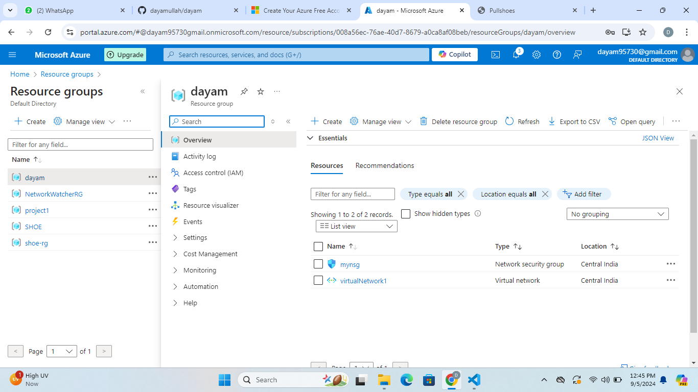
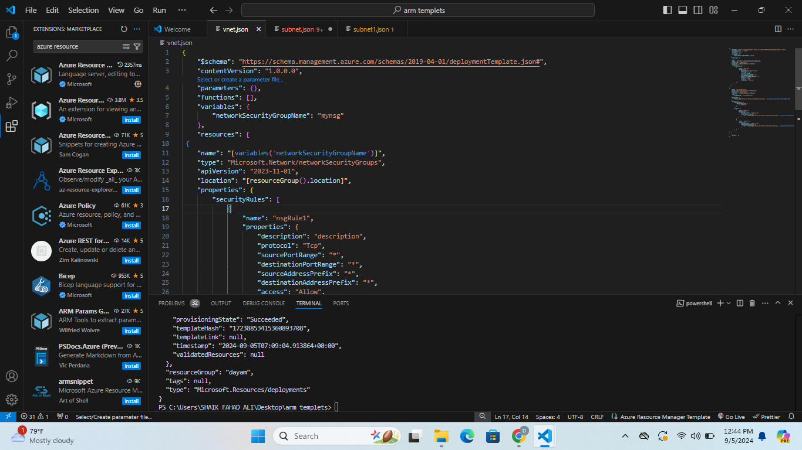
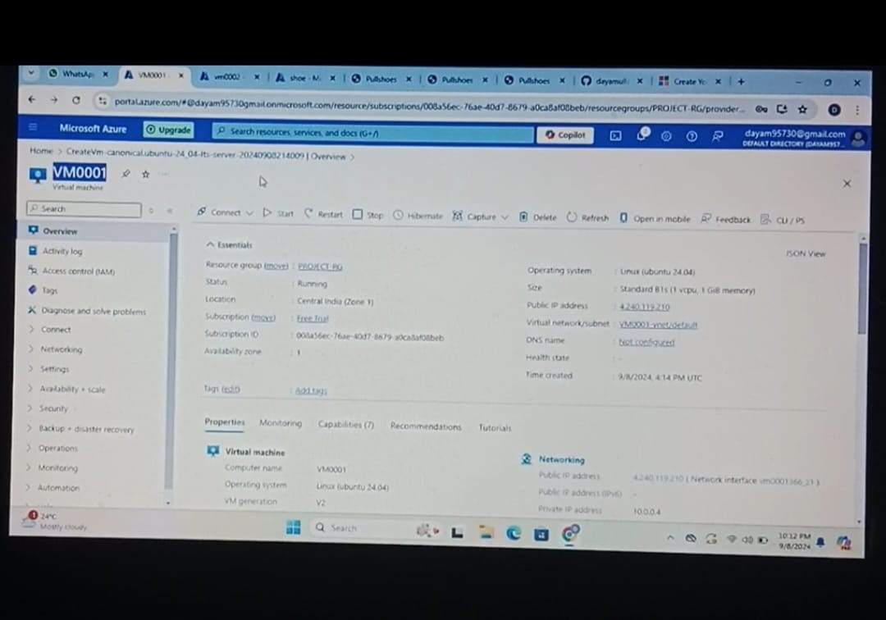
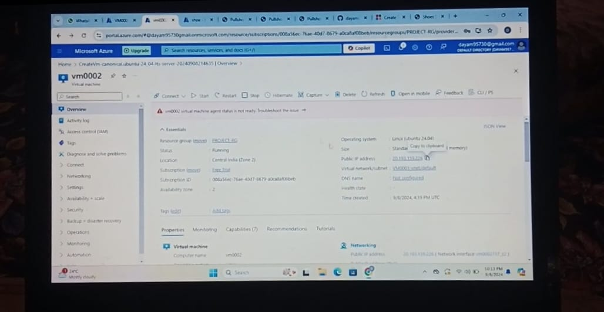
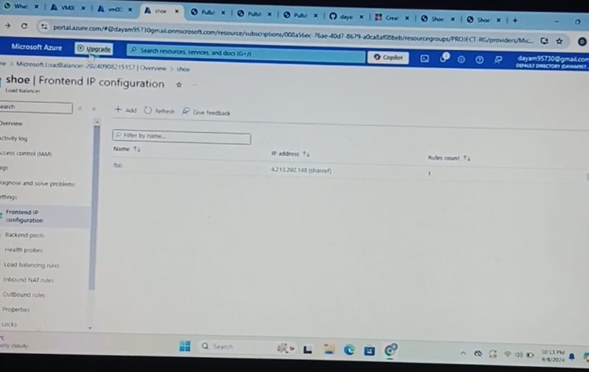
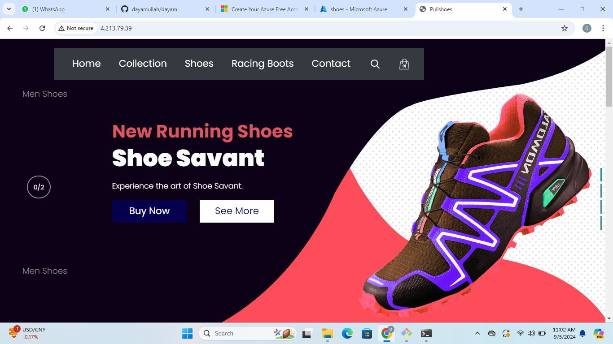
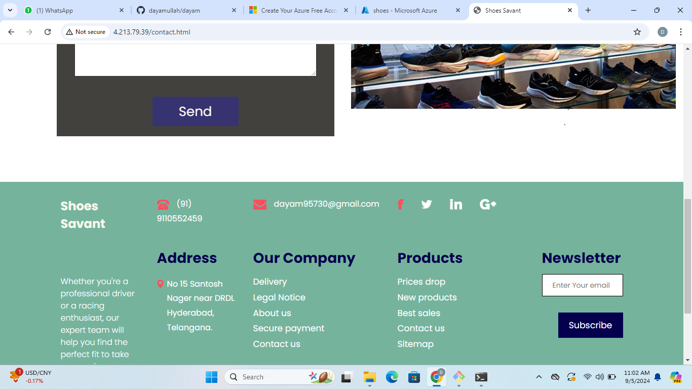
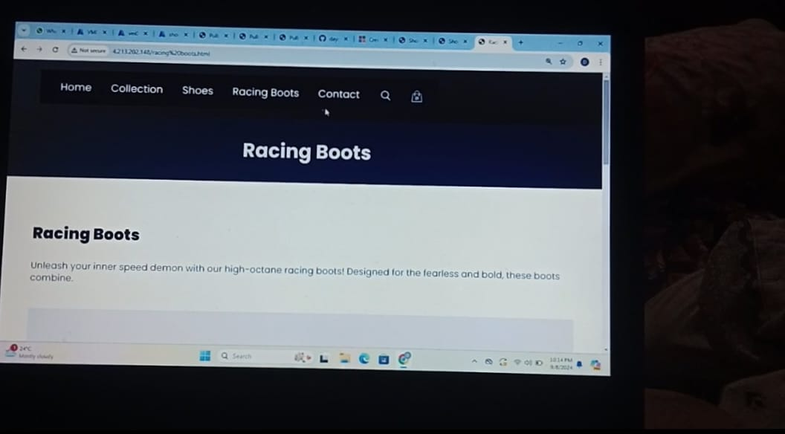
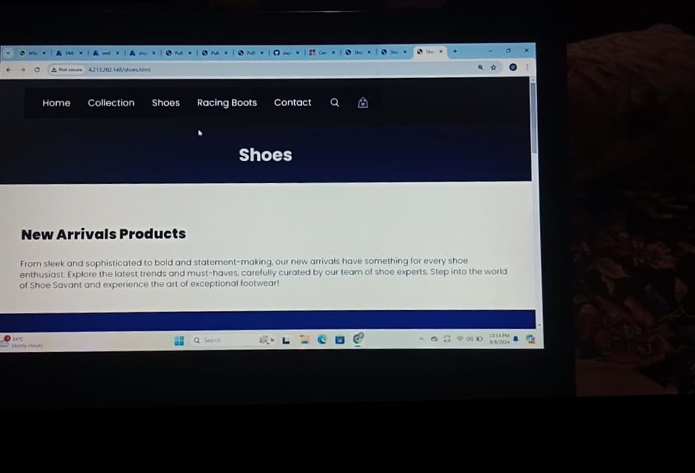

# Deploying Static Website using Load Balancer by ARM Template

## Project Overview

**Shoe Savant** is a website that allows users to browse and purchase sports shoes, offering a wide selection of high-quality shoes at affordable prices. The site aims to simplify the shopping experience by providing an intuitive and user-friendly interface for selecting sports shoes.

This project demonstrates the deployment of **Shoe Savant** using Azure's ARM templates and load balancing across two Virtual Machines (VMs) in different availability zones for high availability and scalability.

## Problem Statement

Finding high-quality sports shoes at affordable prices can be challenging, especially when browsing multiple websites. **Shoe Savant** solves this problem by providing a streamlined shopping experience with a wide selection of sports shoes in one place. After building the website, the challenge was to deploy it on Azure using a load-balanced architecture for efficient traffic distribution.

## Project Goals

- Deploy the **Shoe Savant** website on Azure using ARM templates.
- Set up a **Virtual Network (VNet)** with two **Subnets** and a **Network Security Group (NSG)**.
- Use a **Load Balancer** to distribute traffic between two VMs located in different availability zones.
- Host the static website on these VMs and make it accessible via the load balancer's frontend IP.

## Technologies and Azure Services Used

1. **Azure CLI**: Used to create the resource group and Virtual Network.
2. **ARM Templates**: Automated the creation of VNet, subnets, and NSG.
3. **Azure Virtual Machines (VMs)**: Hosted the **Shoe Savant** website.
4. **Azure Load Balancer**: Distributed the traffic between two VMs to ensure high availability.
5. **Nginx**: Used as a web server on both VMs to serve the static content.
6. **Git**: Cloned the website from GitHub onto the VMs using a custom script.
7. **Custom Script Extension**: Used to automatically configure the VMs upon deployment.

## Project Steps

### 1. Website Development
- **Shoe Savant**: A static website allowing users to browse and purchase a variety of sports shoes. 

### 2. Deploying the Website on GitHub
- The frontend of **Shoe Savant** was uploaded to a public GitHub repository: [Frontend-Shoe Savant](https://github.com/abdulrhmn02/Frontend-ShoeSavant.git).

### 3. Azure Deployment Using ARM Templates
- **Resource Group**: Created using Azure CLI to hold all the resources.
- **Virtual Network (VNet)**: Set up using an ARM template, which included two subnets for distributing the VMs.
- **Network Security Group (NSG)**: Applied inbound rules to allow traffic on ports 22 (SSH) and 80 (HTTP).
  
### 4. Virtual Machines Setup
- **VM 1**: Created in Availability Zone 1 using Azure Portal. Configured with:
  - Custom Script Extension to clone the website from GitHub.
  - Networking settings to connect to the VNet and assigned Subnet.
  
  Custom Script:
  ```bash
  #!/bin/bash
  sudo apt update
  sudo apt install nginx git -y
  cd /tmp && git clone https://github.com/dayamullah/dayam.git mysitee
  sudo rm -rf /var/www/html/index.nginx-debian.html
  sudo cp -r /tmp/mysitee/* /var/www/html/
  ```

- **VM 2**: Created in Availability Zone 2 with the same configuration as VM 1.

### 5. Load Balancer Configuration
- **Load Balancer**: Configured to distribute traffic between VM 1 and VM 2.
  - **Frontend IP Configuration**: Assigned a new frontend IP for external access.
  - **Backend Pool**: Added both VMs to the backend pool for traffic distribution.
  - **Load Balancing Rule**: Defined to balance HTTP traffic (port 80) across the VMs.
  - **Health Probe**: Set up to monitor the health of the VMs and ensure traffic is routed only to healthy VMs.

### 6. Testing and Accessing the Website
- After the load balancer deployment, the website became accessible via the frontend IP of the load balancer. Users can interact with **Shoe Savant** to browse and purchase their favorite sports shoes.

## How to Use Shoe Savant

1. Browse the collection of sports shoes.
2. Select your favorite pair and add it to the cart.
3. Proceed to checkout and enjoy affordable, high-quality shoes.

## Azure Services and Tools Used

- **Azure CLI**: Resource group creation and management.
- **Azure Resource Manager (ARM) Templates**: Infrastructure-as-Code to deploy resources.
- **Virtual Network (VNet)**: Networking and subnetting.
- **Network Security Group (NSG)**: Security rules for VM access.
- **Azure Virtual Machines**: Hosting the website on multiple VMs.
- **Azure Load Balancer**: Load balancing between VMs.
- **Nginx**: Web server for hosting static content.
- **Git**: Version control and cloning the website onto VMs.
- **Custom Script Extension**: Automated configuration of VMs.

## Live Website and Resources

- **Website Link**: [Shoe Savant](https://github.com/dayamullah/dayam.git)
- **Screenshots**:
  **Created Resource Group Screenshot**
  - 

  **VNet Subnets RSG ARM Template Output**
  - 

   **Created VNet Screenshot** 
  - 

   **Deployed VM 1 Screenshot**
  - 

  **Deployed VM 2 Screenshot**
  - 

  **Deployed LoadBalancer Screenshot**
  - 

  **Website Home Page Screenshot**
  - 

  **Shop Shoes Page after complete Deployment**
  - 

  **Checkout Page after complete Deployment**
  - 

  **About Us  Page after complete Deployment**
  - 

## Conclusion

This project showcases the end-to-end process of deploying a static website using Azure's ARM templates and load balancing capabilities. By distributing traffic between two VMs in different availability zones, we ensure high availability and scalability for the **Shoe Savant** platform. The integration of Azure's powerful tools and services simplified the deployment and configuration process.

## Author

**Dayamullah Shareef** and **Sravani**